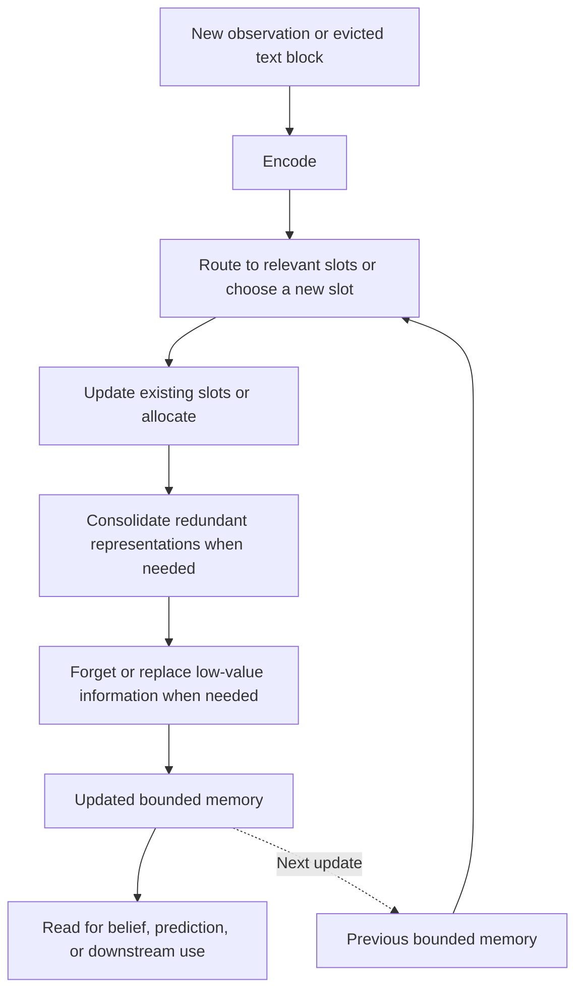

# VELA-Belief

**Learning a bounded, persistent memory that organizes what matters for future prediction.**

VELA-Belief studies how a model can maintain an evolving latent state from a stream of observations. The proposed memory contains a fixed number of slots: new information is routed to relevant slots, existing information is updated, new factors receive space, redundant representations can be consolidated, and low-value information can be forgotten.

The central question is:

> Can a bounded memory preserve useful information over long horizons by learning how to organize, revise, and consolidate it according to its future predictive value?

This is the memory and belief component of **VELA — Value-Aware Evolving Latent Agent**. “Value-aware evolving latent memory” describes the revised research direction developed in [patch.md](patch.md).

**Current status:** only **stage 1** is implemented: a categorical Hidden Markov Model (HMM), an exact Bayesian filter, an observation-only oracle, and a trainable single-vector GRU. Slots, sparse routing, allocation, merging, forgetting, LLM integration, and world-model rollouts are proposed experiments. The current results validate the starting benchmark; they do not validate the proposed structured memory.

## Read the research article

The [expanded paper](docs/paper/index.rst) develops the problem, the reasoning behind the design, related literature, mathematical objectives, application interfaces, existing results, and a detailed nine-stage research map. It combines explanatory text, equations, comparison tables, and original diagrams, with a table of contents in HTML and PDF.

Useful entry points:

- [Motivation and scope](docs/paper/sections/introduction.rst): why memory needs identity, revision, uncertainty, and selective retention.
- [Related work](docs/paper/sections/related_work.rst): Memformer, recurrent memory, ICAE, AutoCompressors, KV compression, object-centric models, and the intended contribution.
- [Memory lifecycle](docs/paper/sections/memory.rst) and [learning objectives](docs/paper/sections/objectives.rst): mechanisms, equations, implementation choices, and failure modes.
- [LLM overflow](docs/paper/sections/llm.rst) and [world models](docs/paper/sections/world_models.rst): distinct interfaces and evaluation requirements.
- [Evaluation](docs/paper/sections/evaluation.rst) and [nine-stage roadmap](docs/paper/sections/roadmap.rst): hypotheses, comparisons, dependencies, deliverables, and decision criteria.

The documents remain in English, consistently with the existing repository. To build them after creating the environment below:

```bash
python -m pip install -e '.[docs]'
make article-html    # docs/_build/html/index.html
make article-latex   # docs/_build/latex/vela-belief.tex
make article         # docs/_build/latex/vela-belief.pdf; requires Tectonic
```

See [article build and editing instructions](docs/paper/README.md). Result tables and plots are regenerated from the archived numerical snapshot; conceptual diagrams are generated separately and contain no experimental results.

## Run the implemented experiment

Requires Python 3.11 or newer. The default benchmark runs on CPU.

An existing environment can be used with `mamba activate vela`. Otherwise, create a virtual environment:

```bash
python3 -m venv .venv
source .venv/bin/activate
python -m pip install torch --index-url https://download.pytorch.org/whl/cpu
python -m pip install -e '.[dev]'

vela-belief train --config configs/hmm.toml --output runs/hmm-first
pytest
```

On Debian, if virtual-environment creation reports that `ensurepip` is unavailable, install the matching `python3-venv` package first. Each training or evaluation command requires a new output directory.

```bash
vela-belief evaluate --checkpoint runs/hmm-first/checkpoint.pt --output runs/hmm-first-eval
```

A run records its resolved configuration, training history, selected inference checkpoint, test metrics, and an example posterior trace. Adjust the environment, latent dimension, loss weights, or training budget in [configs/hmm.toml](configs/hmm.toml); use `--seed 43` for another configured run. `python -m vela_belief` also works in place of `vela-belief`.

The initial model is `Embedding → GRU → belief and next-observation heads`. The encoder, memory, and heads are independent components; the caller passes memory state explicitly for streaming and chunked inference. See the [implementation architecture](docs/architecture.md) and [stage 1 results](docs/stage1-results.md).

## Why maintain a state instead of retaining a history?

In a partially observable system, one observation often leaves several explanations possible. History helps distinguish them. A noisy sensor can reveal a persistent regime through repeated measurements; a conversation can describe one entity across distant passages; an object can remain relevant while out of view.

Consider a red car owned by Alice. A later observation says the car is electric; another says it was sold to Bob. Useful memory should bind the first two facts, revise current ownership, distinguish historical from current information, and preserve uncertainty if the sources disagree. An exact vehicle identifier may need a separate storage policy. These demands motivate a memory that can reorganize information, beyond simply keeping recent tokens.

The initial formulation uses one recurrent vector:

$$
x_t=E_\theta(o_t),\qquad z_t=U_\theta(z_{t-1},x_t).
$$

The proposed formulation makes the state structured:

$$
M_t=[m_t^1;\ldots;m_t^K]\in\mathbb R^{K\times d_m}.
$$

There are at most $K$ occupied slots, each with width $d_m$. Their payload is bounded independently of history length; metadata, projected reader state, and any episodic archive must also be counted. Finite memory cannot retain arbitrary amounts of independent information exactly. The goal is to preserve useful predictions under an explicit budget.

## Proposed memory lifecycle



| Operation | Purpose | Main question |
| --- | --- | --- |
| **Route** | Identify relevant occupied slots, with sparse writes to at most $r\ll K$ rows. | Does routing find the right information without collapsing onto one row? |
| **Update** | Integrate evidence into an existing persistent unit using a gated or attention-based write. | Can it revise one factor without damaging unrelated information? |
| **Allocate** | Create a unit for information not adequately represented. | Can it distinguish a new factor from another mention of an existing one? |
| **Consolidate** | Combine complementary or redundant units and release capacity. | Are future predictions preserved after one merge and many repeated merges? |
| **Forget** | Delete or replace information with low expected future utility. | Can it retain rare but important facts while adapting to real changes? |

A slot is intended to become a useful unit of state, potentially an entity, relation, goal, regime, or constraint. Human-readable concepts are not guaranteed. Sparse writes and predictive learning may encourage specialization; controlled probes and interventions must establish whether it actually occurs.

Consolidation differs from deletion: two car-related slots could combine complementary attributes instead of losing one set. Geometric similarity alone is insufficient to establish redundancy. The proposed test compares predictions before and after a merge over relevant future queries. Similarly, normalized attention alone is insufficient to detect novelty: even poor matches must receive some softmax mass.

## What the memory learns to preserve

For an action-free hidden-state system, the belief is

$$
b_t(s)=P(S_t=s\mid o_{0:t}).
$$

Under the known state-space model, this distribution summarizes the history needed for future prediction and represents uncertainty. Stage 1 trains a decoder $\hat b_t=D_\theta(z_t)$ to approximate the exact HMM posterior. Hidden states and reference beliefs are training targets or evaluation data, never inputs to the memory update.

The implemented objectives support next-observation likelihood, posterior KL matching, and optional hidden-state supervision. The archived runs combine belief matching and next-observation prediction. Later slot experiments may add sparsity, persistence, diversity, merge consistency, and capacity penalties. These are hypotheses to ablate: excessive persistence can prevent correction, and excessive diversity can separate related information artificially.

For tasks without an exact posterior, the broader target is

$$
p(Y_{\mathrm{future}}\mid H_t,Q)
\approx p_\theta(Y_{\mathrm{future}}\mid M_t,Q),
$$

where $H_t$ is available history and $Q$ specifies the future question or prediction task. What is worth remembering depends on that task distribution. Good average prediction does not guarantee exact recall of a rarely queried identifier.

## LLM overflow memory

The proposed LLM integration keeps ordinary Transformer context until old content must be evicted. At overflow event $n$, VELA folds only the evicted block into its persistent state:

$$
M_n=U_\theta(M_{n-1},E_\theta(X_{\mathrm{evicted},n})).
$$

The reader then consumes projected memory alongside recent verbatim text:

$$
[P_\theta(M_n),X_{\mathrm{recent}}],\qquad P+W+G\le C.
$$

Here $P$ counts projected memory tokens, $W$ recent and pinned text, $G$ reserved generation space, and $C$ the context limit. One token per slot gives $P=K$. The writer updates at eviction events; the LLM can read the resulting memory between those events.

Two prospective interfaces are:

- **VELA-S:** soft tokens projected into the embedding space of a potentially frozen LLM. Train the writer and projection using full-context teacher distributions on sequences that fit the teacher's window.
- **VELA-KV:** project semantic slots directly into layer-specific keys and values. This requires additional cache and positional integration and a separate accounting of projected KV storage.

A changed memory prefix can invalidate cached activations of the retained suffix, even though its tokens remain verbatim. The first prototype should re-prefill that suffix and measure the cost. A frozen reader still requires differentiable embedding access during adapter training; compatibility with an arbitrary LLM or text-only API is not established.

A bounded episodic component could retain exact strings alongside semantic slots. Its storage, retrieval cost, and any backing archive count toward the total budget. The decisive stress test is **repeated consolidation**: whether facts, instructions, revisions, and uncertainty survive many overflow events, not only one compression.

## Structured state for world models

In an interactive environment, inference also consumes the previous action:

$$
M_t=U_\theta(M_{t-1},E_\theta(o_t),a_{t-1}).
$$

A later world model would add action-conditioned latent dynamics, observation decoding, and where relevant reward prediction. Persistent slots could track occluded objects, relationships, or latent regimes, potentially alongside a stochastic innovation variable.

Inference with a real observation and imagination without that observation are different operations. Accurate belief decoding alone does not establish valid multi-step rollouts. The planned path starts with Kalman-reference continuous systems, then partially observed multi-entity environments, then calibrated rollouts and controlled planning comparisons.

## Position in the literature

Persistent memory, learned addressing, and latent compression have substantial precedents. [Memformer](https://arxiv.org/abs/2010.06891) already uses external memory slots; [Recurrent Memory Transformer](https://arxiv.org/abs/2207.06881) passes memory tokens across segments. [ICAE](https://arxiv.org/abs/2307.06945) learns compact memory vectors, while [AutoCompressors](https://aclanthology.org/2023.emnlp-main.232/) already performs recursive compression. [LoCoCo](https://arxiv.org/abs/2406.05317) and [DMC](https://arxiv.org/abs/2403.09636) combine KV representations rather than merely deleting entries.

VELA's intended contribution is to study a complete slot lifecycle under predictive constraints, with explicit tests of organization, sparse updates, and consolidation stability. The [related-work section](docs/paper/sections/related_work.rst) also covers filtering, NTM/DNC, Compressive Transformer, Activation Beacon, Titans, selective state-space models, Slot Attention, SlotFormer, and world models. No advantage over these methods has yet been demonstrated.

## Experimental roadmap

| Stage | Addition | Evidence sought |
| --- | --- | --- |
| **1 — implemented** | Single-vector HMM belief baseline. | Exact-reference correctness and posterior approximation. |
| **2** | Structured slot memory. | Quality versus GRU/LSTM and dense attention at comparable budgets. |
| **3** | Sparse routing and specialization. | Selective writes, intervention evidence, measured cost. |
| **4** | Allocation and learned forgetting. | Retention of delayed facts, adaptation, capacity handling. |
| **5** | Consolidation and merge. | Recovered capacity and limited cumulative predictive loss. |
| **6** | Representation pressures. | Ablations of sparsity, persistence, diversity, merge, and budget losses. |
| **7** | Structured world-model state. | Continuous beliefs, uncertainty, rollouts, then planning. |
| **8** | Frozen-LLM overflow / VELA-S. | Repeated-overflow retention with recent text kept verbatim. |
| **9** | Layer-aware integration / VELA-KV. | Quality and total latency/memory versus soft tokens and KV methods. |

Stages 7 and 8 form separate application branches after the shared memory study; stage 9 depends on stage 8. Continuous-state benchmarks and representation analysis remain cross-cutting tracks. The [detailed map](docs/paper/sections/roadmap.rst) specifies comparisons, dependencies, deliverables, and failure criteria for every stage.

Success is measured jointly through **predictive quality, memory, compute, stability, and specialization**. State size, parameter count, training budget, recent context, and projected KV storage must be explicit. Sparse writes do not remove dense routing cost, and bounded inference state does not imply bounded training activation storage.

The current three HMM runs have overlapping seed offsets across experiments and are not independent statistical replications. Their longer-sequence evaluation checks continued filtering, not isolated recall of ancient information. Future experiments require independent streams, matched learned baselines, capacity pressure, delayed queries, and uncertainty estimates that respect temporal dependence.

## The broader VELA project

```text
Observation history → Structured belief → Stochastic dynamics → Decision
```

The tentative module sequence remains `vela-belief → vela-american → vela-battery → vela-multienv → vela-decision → vela-foundation`, covering later optimal stopping, stochastic control, decision-aware representations, and cross-environment pretraining. The nine stages above develop the memory component; those broader modules remain separate future work.
