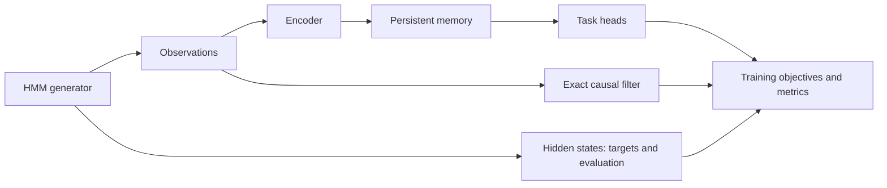

# Architecture and experiment protocol

Stage 1 establishes a measurable recurrent baseline. The extensibility boundary is between **data generation**, **reference inference**, and **the learned sequence model**. The trainer connects them for the HMM task.



## Code organization

| Module | Responsibility |
| --- | --- |
| `environments/hmm.py` | Validate the HMM and sample independent sequences with an explicit generator |
| `references/hmm.py` | Exact causal filtering and the observation-only reference |
| `models/memory.py` | Memory interface and single-vector GRU implementation |
| `models/sequence.py` | Compose an encoder, memory, and named output heads |
| `objectives.py` | Categorical belief, state, and prediction losses |
| `metrics.py` | Shared probability metrics for learned and analytic models |
| `config.py` | Validated dataclasses and strict TOML loading |
| `experiments/hmm.py` | Build the HMM model, train, select a checkpoint, and evaluate |
| `cli.py` | Thin command-line interface |

Only the experiment knows how to assemble these components for a categorical HMM. The sequence model does not import an environment, a reference filter, or training configuration. There is no plugin registry or general training framework to maintain at this stage.

## The initial neural model

The default architecture has **4,964 trainable parameters**:

- A categorical embedding maps the two observation symbols to 16 dimensions.
- A single-layer GRU updates a 32-dimensional latent vector.
- Two linear heads produce hidden-state logits and next-observation logits.

The prediction head is learned independently: it does not use the known transition or emission matrices. Softmax converts each head's logits into a categorical distribution at evaluation time.

A [GRU](https://docs.pytorch.org/docs/stable/generated/torch.nn.GRU.html) provides a compact recurrent starting point with gated state updates. This is an established baseline, not a claim of a new memory mechanism. It lets later experiments measure the contribution of slots, allocation, and forgetting against a working reference.

## Memory contract

All sequence tensors are batch-first. `B` is batch size, `T` is sequence length, `E` is embedding size, and `D` is readout size.

```python
latents, final_state = memory(embeddings, state=None)
# embeddings:  [B, T, E]
# latents:     [B, T, D]
# final_state: [B, ...]
```

`state=None` initializes a new independent sequence. The caller owns the state: the model has no mutable hidden state shared across requests. A GRU returns `[B, D]`; a future slot memory can return `[B, K, M]` while exposing the same `[B, T, D]` readout to the heads.

Full-sequence execution, chunked execution, and repeated one-step calls must agree. The tests enforce this property as well as causality and independence between batch items.

```python
import torch
from vela_belief.experiments.hmm import load_checkpoint

model, config = load_checkpoint("runs/hmm-first/checkpoint.pt")
with torch.inference_mode():
    first = model(torch.tensor([[0, 1, 1]]))
    following = model(torch.tensor([[1, 0]]), state=first.state)
    current = model.step(torch.tensor([0]), state=following.state)
    belief = current.predictions["belief"].softmax(-1)
```

For training on consecutive chunks, keep the returned state attached for full backpropagation or call `detach_state` explicitly for truncated backpropagation. Stage 1 trains on complete independent sequences and resets between batches. Padding, variable-length batches, and asynchronous per-item resets are not implemented.

## HMM indexing and numerical conventions

The initial distribution is `P(S[0])`. The generator samples `S[0]`, then emits `O[0]`; the first transition occurs before `O[1]`.

```text
A[i, j] = P(S[t+1] = j | S[t] = i)
B[i, o] = P(O[t] = o | S[t] = i)
b[t]    = P(S[t] | O[0], ..., O[t])
q[t]    = b[t] @ A @ B = P(O[t+1] | O[0], ..., O[t])
```

The filter uses float64 and log-space normalization. It accepts structural zeros and reports impossible observation sequences instead of returning NaNs. Tests compare it with exhaustive hidden-path enumeration on a small asymmetric HMM, verify long unlikely sequences, and check that future observations cannot change earlier beliefs.

The observation-only reference computes `P(S[t] | O[t])`, using the unconditional time-dependent prior `initial @ A**t`. It knows the parameters and time index but does not retain observation history. This is an oracle reference for the value of history, not a trained fixed-window baseline.

## Training and held-out evaluation

Each batch contains `T+1` sampled observations. The model sees the first `T`; positions `1` through `T` are its next-observation targets. The exact filter processes only the input prefix. Hidden states and posterior targets never enter the encoder or memory.

The default loss is:

```text
mean KL(exact belief || learned belief)
+ mean negative log-likelihood of the actual next observation
```

An optional hidden-state cross-entropy term shares the belief head. All terms are averaged over batch and time. The three weights are configurable; at least one must be positive. With belief supervision disabled, the belief decoder is not directly taught the exact posterior unless the state loss is active.

Training uses Adam, gradient clipping, and fresh simulated batches. Validation is a fixed independent set. The checkpoint with the lowest **weighted validation loss** is retained; test results do not influence checkpoint selection.

The experiment seed controls model initialization. Separate local random generators use `seed+1` for training, `seed+2` for validation, `seed+3` for test, and `seed+4` for longer test sequences. Evaluation never advances the training generator. This separates data streams within each run; it is not a claim that finite-alphabet sequences cannot coincide by chance.

Adjacent experiment seeds reuse some generator seeds across runs. In particular, test sequences from one run can share prefixes with another run's longer test sequences. The current three runs are therefore not independent statistical replications; future uncertainty estimates require a disjoint experiment-level seed scheme.

The default protocol uses 800 updates, batches of 64 sequences of length 64, 256 validation sequences, and 512 test sequences. A second test uses length 256. `long_test_tail` scores only positions after the first 64 observations, while preserving the full preceding memory.

The reported scores are:

| Metric | Meaning | Better |
| --- | --- | --- |
| `belief_kl` | Mean KL from the exact posterior to the predicted posterior, in nats | Lower |
| `belief_mae` | Mean absolute posterior-probability error across states | Lower |
| `state_accuracy` | Accuracy of the most likely hidden state | Higher |
| `state_brier` | Sum of squared probability errors against the realized state, averaged over batch and time | Lower |
| `next_observation_kl` | Mean KL from the exact predictive distribution to the predicted one | Lower |
| `next_observation_nll` | Negative log-probability of the actual next observation, in nats | Lower |

The KL metrics clamp tiny negative roundoff to zero. All models receive the same test observations. An analytic filter minimizes expected probabilistic loss under its known HMM, but finite-sample accuracy or NLL need not always rank it first.

## Artifacts and reproducibility

Each new run directory contains:

| Artifact | Contents |
| --- | --- |
| `config.json` | Fully resolved configuration, including CLI seed overrides |
| `history.jsonl` | Training loss and validation components at evaluation checkpoints |
| `checkpoint.pt` | Format version, configuration, selected step, and model weights |
| `metrics.json` | Test scores, long-sequence scores, selected step, seeds, versions, and runtime |
| `trace.json` | One held-out sequence with true states and posterior trajectories |

The checkpoint is for inference and evaluation; it does not contain optimizer or generator state for resuming training. `evaluate` regenerates the same held-out data from its stored configuration. Existing output directories are rejected to preserve previous runs.

CPU execution uses deterministic algorithms and an explicit thread count. The experiment restores the caller's CPU RNG and thread/determinism settings. Exact reproduction is tested in the same software environment; [PyTorch does not guarantee identical results across releases or platforms](https://docs.pytorch.org/docs/stable/notes/randomness.html). The benchmark intentionally starts with CPU execution rather than adding device orchestration to a small experiment.

## Extending the project

- **Memory slots:** implement the `Memory` interface with a structured state and a readout, then select it in the experiment's model builder. Keep the sequence-equivalence tests. Extend configuration and checkpoint reconstruction when adding the new variant.
- **Continuous observations:** supply a linear or MLP encoder and suitable distribution heads. Add the environment and its reference filter separately. The sequence model can remain unchanged.
- **World models:** add action inputs and transition/observation objectives in a dedicated experiment. The current next-observation head is not a latent rollout model.
- **LLM context compression:** provide a text or representation encoder and a downstream memory reader, with benchmarks for retained information. No language-specific assumptions belong in the base memory interface.

Generalize the training loop when a second concrete task demonstrates shared needs. Stage 1 keeps the reusable model small and the experimental assumptions visible.
